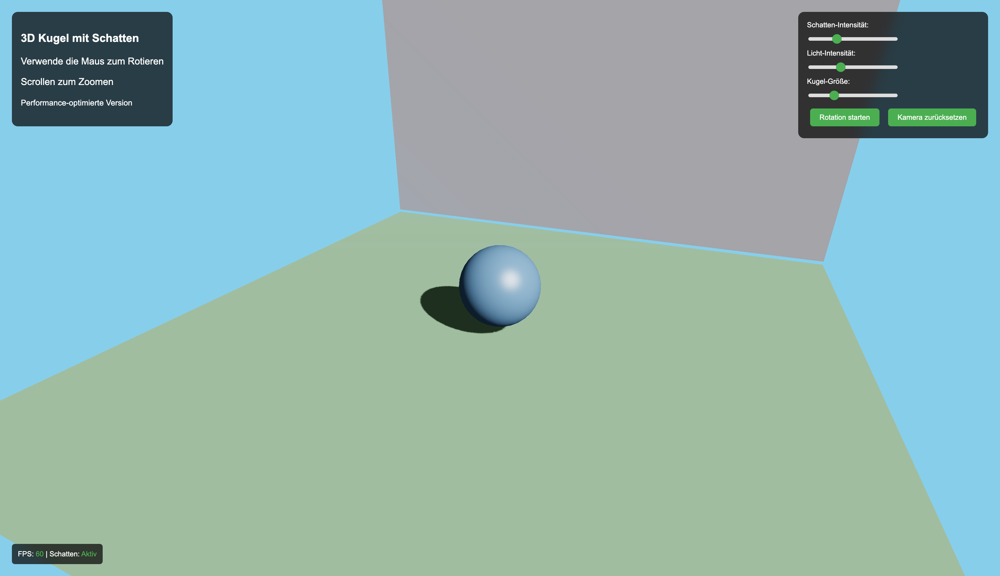

# 3D Kugel mit realistischen Schatten - Performance-Optimiert

Eine hochoptimierte 3D-Anwendung, die eine Kugel mit realistischen Schatten und Beleuchtung darstellt.



## Features

- **3D-Kugel** mit realistischen Schatten
- **Interaktive Steuerung** (Maus, Scroll, Schieberegler)
- **Performance-Monitoring** (FPS, adaptive Schatten)
- **Optimierte Performance** (reduzierte Geometrie, effiziente Schatten)

## Verwendung

### Installation
1. Alle Dateien im gleichen Verzeichnis
2. `index.html` im Browser öffnen

### Steuerung
- **Maus bewegen**: Kamera rotiert um die Kugel
- **Scrollen**: Ein-/Auszoomen
- **Schieberegler**: Schatten, Licht, Kugel-Größe anpassen
- **Buttons**: Rotation pausieren, Kamera zurücksetzen

## Technische Details

### Technologien
- **Three.js** für 3D-Grafik
- **WebGL** für Hardware-Beschleunigung
- **Vanilla JavaScript**

### Performance-Optimierungen
- Reduzierte Geometrie (32x32 statt 64x64)
- Effiziente Schatten (PCF Shadow Mapping)
- Throttling & Debouncing
- Frame-Rate-Limiting (60fps)
- Memory Management

## Browser-Kompatibilität

- Chrome 60+, Firefox 55+, Safari 12+, Edge 79+

## Anpassungen

### Kugel-Material ändern
```javascript
const material = new THREE.MeshPhongMaterial({
    color: 0x4A90E2,        // Farbe
    shininess: 100,         // Glanz
    specular: 0x444444      // Spiegelung
});
```

### Schatten-Qualität
```javascript
this.light.shadow.mapSize.width = 2048;   // Höhere Auflösung
this.light.shadow.mapSize.height = 2048;  // Mehr Speicherverbrauch
```

## Fehlerbehebung

- **Schatten nicht sichtbar**: WebGL-Unterstützung prüfen
- **Performance-Probleme**: Schatten-Auflösung reduzieren
- **Lädt nicht**: Internetverbindung und Dateien prüfen

## Lizenz

MIT-Lizenz - Frei verwendbar, modifizierbar und verteilbar.
