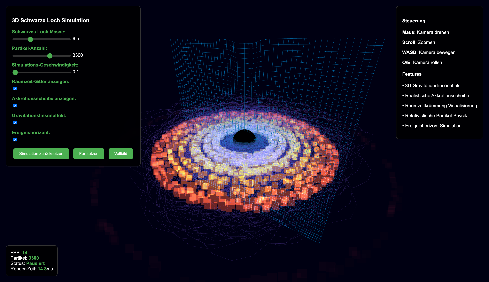
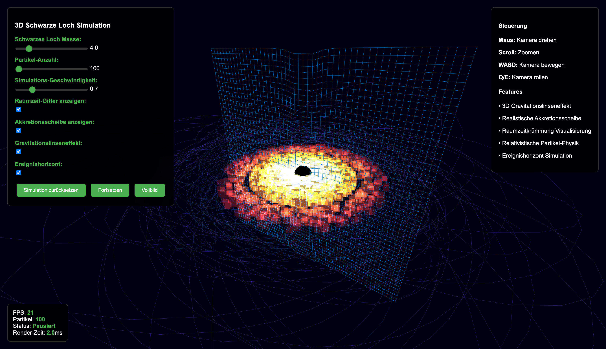

# 3D Schwarze Loch Simulation

Eine 3D-Simulation eines Schwarzen Lochs mit Gravitationslinseneffekt, Akkretionsscheibe und relativistischer Partikel-Physik.

## 📸 Screenshots

  
  

## Features

- 3D Schwarzes Loch mit Ereignishorizont
- Gravitationslinseneffekt
- Akkretionsscheibe
- Partikel-System mit realistischer Physik
- Raumzeit-Gitter Visualisierung

## Start

Öffne `index.html` in einem modernen Webbrowser.

## Steuerung

- **Maus**: Kamera drehen
- **Scroll**: Zoomen
- **WASD**: Kamera bewegen
- **Q/E**: Kamera rollen

## Einstellungen

- Masse: 1.0 - 20.0
- Partikel: 100 - 5000
- Geschwindigkeit: 0.1x - 3.0x
