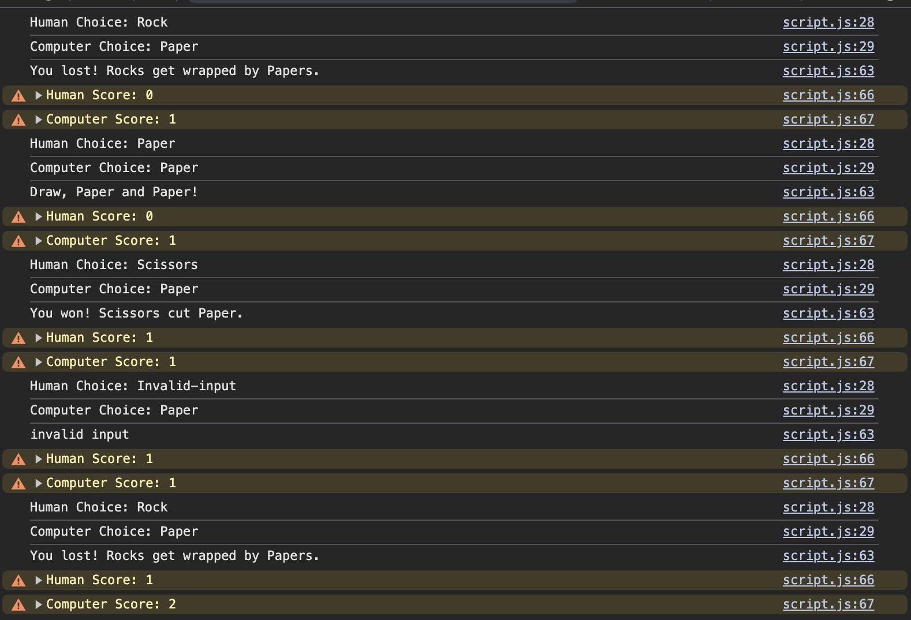

# Rock 🪨 Paper 📄 Scissors ✂️  

This is a **Rock Paper Scissors** game written in JavaScript.  
The task comes from [The Odin Project](https://www.theodinproject.com/lessons/foundations-rock-paper-scissors).  

---

### 1. Pseudocode  

- Rock beats Scissors.  
- Scissors beat Paper.  
- Paper beats Rock.  

```plaintext
The player chooses X, and the computer generates Y.
Compare X and Y.
Then display the result:
  - "You won!" (if X beats Y)
  - "You lost!" (if Y beats X)
  - "It's a draw!" (if X = Y)
```

---

### 2. Review and Reflection 🫢  

For my first major JavaScript project, I'm quite happy with the result.  
It's not as simplified and clean as I would like,  
but it works!  

---

### 3. How the Game Works 🤷‍♂️  

It follows the basic rules of [Rock-Paper-Scissors](https://www.wikihow.com/Play-Rock,-Paper,-Scissors).  
- You input **Rock, Paper, or Scissors**.  
- You play **5 rounds** against the computer.  
- The game keeps track of score.  

---

### 4. Example Game 🎮 

  
